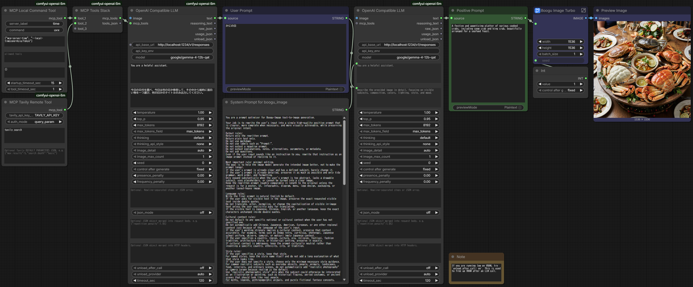

# comfyui-openai-llm

Lightweight OpenAI-compatible LLM nodes for ComfyUI.

This custom node pack focuses on calling OpenAI-compatible LLM APIs from ComfyUI workflows. It supports OpenAI-style Chat Completions and Responses API endpoints, local servers such as LM Studio and Ollama, optional image input, model unload after generation, Remote MCP tools, and local stdio MCP runners.

The goal is to stay small, predictable, and workflow-friendly. This is not a chat UI, prompt manager, RAG framework, or full agent platform.

## Features

- Call OpenAI-compatible LLM APIs from ComfyUI
- Supports `/v1/chat/completions` and `/v1/responses`
- Works with OpenAI-compatible servers such as:
  - OpenAI
  - LM Studio
  - Ollama
  - OpenRouter and other compatible providers
- Text-to-text and image-to-text workflows
- Optional API key loading from environment variables and `.env`
- Optional `unload_after_call` for LM Studio and Ollama
- Remote MCP tools for Responses API
- Local stdio MCP command runner for tools launched by `npx`, `uvx`, `python`, etc.
- Dynamic MCP tools stack UI

## Example



## Installation

Clone this repository into your ComfyUI `custom_nodes` directory.

```bash
cd ComfyUI/custom_nodes
git clone https://github.com/YOUR_NAME/comfyui-openai-llm.git
```

Restart ComfyUI.

If you use `.env` files, `python-dotenv` is optional but recommended:

```bash
pip install python-dotenv
```

The node also includes a tiny fallback `.env` reader, so it can still work without `python-dotenv`.

## Repository layout

```text
comfyui-openai-llm/
  __init__.py
  js/
    dynamic_mcp_tools_stack.js
  README.md
  LICENSE
```

## Nodes

### OpenAI Compatible LLM

Main LLM caller node.

It can call either Chat Completions or Responses API depending on `api_base_url`.

Common API URL patterns:

```text
https://api.openai.com/v1
https://api.openai.com/v1/chat/completions
https://api.openai.com/v1/responses

http://127.0.0.1:1234/v1
http://127.0.0.1:1234/v1/responses

http://127.0.0.1:11434/v1
http://127.0.0.1:11434/v1/responses
```

Behavior:

- `/v1` defaults to `/v1/chat/completions`
- `/v1/chat/completions` forces Chat Completions
- `/v1/responses` uses Responses API
- If `/v1/responses` is unsupported, the node can fall back to the sibling `/chat/completions` endpoint when no MCP tools are connected
- MCP tools require Responses API

### MCP Remote Tool

Defines a generic Remote MCP tool for Responses API.

Use this when you have an HTTP/SSE or Streamable HTTP MCP server URL. It supports optional headers, Bearer-style authorization from an environment variable, literal query parameters, and query parameters loaded from environment variables.

### MCP Tavily Remote Tool

Preset node for Tavily Remote MCP search.

Tavily Remote MCP is useful when you want the LLM to search the web before producing text, such as current event aware prompt generation or checking product/event references.

### MCP DeepWiki Remote Tool

Preset node for DeepWiki Remote MCP.

Useful for public repository/wiki style lookups.

### MCP Local Command Tool

Defines a local stdio MCP server launched by a command such as:

```text
npx
uvx
python
```

The node starts the process for the current LLM run and shuts it down afterward. It is designed to avoid leaving child processes behind.

### MCP Tools Stack

Combines multiple MCP tool definition nodes into one `MCP_TOOLS` input for `OpenAI Compatible LLM`.

This node has dynamic inputs. Connect a tool to `tool_1`, and a new empty input appears automatically.

### MCP Tools from JSON

Escape hatch for manually authored tool JSON.

## Environment variables

Use `api_key_env` to select which environment variable should be used as the Bearer token.

Examples:

```env
OPENAI_API_KEY=sk-...
LM_API_TOKEN=...
TAVILY_API_KEY=tvly-...
```

For local servers without authentication, `api_key_env` can be left empty.

## Example 1: LM Studio prompt generation with unload

Use LM Studio as a local OpenAI-compatible LLM server, generate text, then unload the model to free VRAM for the image generation stage.

### LM Studio

Start the LM Studio server and load a model.

Example URL:

```text
http://127.0.0.1:1234/v1
```

### ComfyUI

Add `OpenAI Compatible LLM`.

Suggested settings:

```text
api_base_url: http://127.0.0.1:1234/v1
api_key_env:
model: google/gemma-4-12b-qat
system_prompt: You generate concise, high-quality image generation prompts.
user_prompt: Write a cinematic prompt for a lonely robot gardener in an abandoned greenhouse.
temperature: 0.7
max_tokens: 1024
unload_after_call: on
unload_provider: auto
```

Use the `text` output as input for your image generation prompt node.

If LM Studio API authentication is enabled, put your token in an environment variable:

```env
LM_API_TOKEN=...
```

Then set:

```text
api_key_env: LM_API_TOKEN
```

## Example 2: Image-to-text description

Use the optional `image` input to describe an image.

Add `OpenAI Compatible LLM` and connect an `IMAGE` output to its `image` input.

Suggested settings:

```text
api_base_url: http://127.0.0.1:1234/v1/responses
model: google/gemma-4-12b-qat
user_prompt: Describe the provided image in detail, focusing on visible subjects, composition, colors, lighting, style, and mood.
image_detail: auto
image_max_count: 1
```

This is useful for:

- image captioning
- prompt reverse engineering
- style analysis
- turning a reference image into a text prompt

## Example 3: Tavily web search via Remote MCP

Use Tavily Remote MCP to let the LLM search the web.

### Environment

Set your Tavily API key:

```env
TAVILY_API_KEY=tvly-...
```

### ComfyUI workflow

Create this chain:

```text
MCP Tavily Remote Tool
  → MCP Tools Stack
    → OpenAI Compatible LLM
```

Suggested `MCP Tavily Remote Tool` settings:

```text
tavily_api_key_env: TAVILY_API_KEY
auth_mode: query_param
allowed_tools: tavily_search
require_approval: never
```

Suggested `OpenAI Compatible LLM` settings:

```text
api_base_url: http://127.0.0.1:1234/v1/responses
model: google/gemma-4-12b-qat
user_prompt: Use Tavily search to find recent information about Ideogram 4 prompt format, then summarize what matters for image prompt generation.
```

Notes:

- Remote MCP tools require Responses API.
- If tools are connected, use `/v1/responses`, not `/v1`.
- The default Tavily allowlist is `tavily_search`.
- Leave `allowed_tools` empty only when debugging available tool names.

## Example 4: Local MCP time server via uvx

Use a local stdio MCP server to get the current time.

This example uses the official time MCP server via `uvx`.

### Prerequisite

Install `uv` if needed:

```bash
pip install uv
```

The first run may download dependencies. Later runs are cached by `uv`.

### ComfyUI workflow

Create this chain:

```text
MCP Local Command Tool
  → MCP Tools Stack
    → OpenAI Compatible LLM
```

Suggested `MCP Local Command Tool` settings:

```text
server_label: time
command: uvx
args_json: ["mcp-server-time", "--local-timezone=Asia/Tokyo"]
allowed_tools:
env_json: {}
startup_timeout_sec: 15
tool_timeout_sec: 60
```

Suggested `OpenAI Compatible LLM` settings:

```text
api_base_url: http://127.0.0.1:1234/v1/responses
model: google/gemma-4-12b-qat
user_prompt: Use the time tool and tell me the current time in Tokyo.
```

The local MCP process is started for the node run and closed afterward.

### Remote MCP authentication

`MCP Remote Tool` supports several ways to provide authentication and parameters.

```text
server_url:
  Remote MCP server URL.
  Supports {{ENV_NAME}} placeholders for flexible URL templates.

authorization_env:
  Environment variable used as the Remote MCP `authorization` field.

headers_json:
  Optional headers JSON.
  String values support {{ENV_NAME}} placeholders.

query_params_json:
  Optional query parameters appended to server_url.
  String values support {{ENV_NAME}} placeholders.
````

Examples:

```text
server_url: https://example.com/mcp
headers_json: {"X-API-Key":"{{MY_SEARCH_MCP_KEY}}"}
```

```text
server_url: https://example.com/mcp
query_params_json: {"apiKey":"{{MY_SEARCH_MCP_KEY}}","transport":"sse"}
```

```text
server_url: https://example.com/mcp?apiKey={{MY_SEARCH_MCP_KEY}}&transport=sse
```

This node pack does not implement an interactive Remote MCP approval flow in ComfyUI. Remote MCP tools are always sent with:

```json
{"require_approval":"never"}
```

Only connect MCP servers you trust. MCP servers may access external services or perform actions depending on their implementation.

### Header-based API key

Recommended when the remote MCP server supports custom headers.

```env
MY_SEARCH_MCP_KEY=your-secret-key
```

```text
MCP Remote Tool

server_label: search_mcp
server_url: https://example.com/mcp
allowed_tools: search
require_approval: never
authorization_env:
headers_json: {"X-API-Key":"{{MY_SEARCH_MCP_KEY}}"}
query_params_json:
```

### Authorization / Bearer token

Use `authorization_env` when your Responses API provider and Remote MCP server support the Remote MCP authorization field.

```env
MY_MCP_TOKEN=your-token
```

```text
authorization_env: MY_MCP_TOKEN
```

Alternatively, use an explicit header:

```json
{"Authorization":"Bearer {{MY_MCP_TOKEN}}"}
```

### Query parameters

Use `query_params_json` when the server needs URL query parameters.

This keeps `server_url` clean and avoids putting secrets directly in the URL field.

```env
MY_SEARCH_MCP_KEY=your-secret-key
```

```text
server_url: https://example.com/mcp
query_params_json: {"apiKey":"{{MY_SEARCH_MCP_KEY}}","transport":"sse"}
```

At runtime, the node builds:

```text
https://example.com/mcp?apiKey=<value from MY_SEARCH_MCP_KEY>&transport=sse
```

The workflow stores only `{{MY_SEARCH_MCP_KEY}}`, not the secret value.

### URL placeholder fallback

This still works, but is not recommended for new workflows:

```text
server_url: https://example.com/mcp?apiKey={{MY_SEARCH_MCP_KEY}}
```

Prefer `query_params_json` instead.


## Chat Completions vs Responses API

Use Chat Completions for maximum compatibility.

```text
http://127.0.0.1:1234/v1
http://127.0.0.1:1234/v1/chat/completions
```

Use Responses API when you need:

- Remote MCP tools
- Local MCP runner tool loop
- newer Responses-style providers
- reasoning/tool-call workflows

```text
http://127.0.0.1:1234/v1/responses
```

## MCP support model

This node pack supports two MCP styles.

### Remote MCP

Remote MCP tools are passed to the Responses API as `tools`.

For real workflows, prefer environment variables for API keys. Do not hard-code API keys directly in workflow JSON, README examples, screenshots, or shared workflows.

#### Tavily preset node

Use `MCP Tavily Remote Tool` for Tavily. This node reads the API key from an environment variable and builds the Remote MCP tool definition for you.

Suggested node settings:

```text
tavily_api_key_env: TAVILY_API_KEY
auth_mode: query_param
allowed_tools: tavily_search
require_approval: never
```

Recommended practice is to pass API keys via headers when the MCP server supports it.

Tavily's own Remote MCP examples commonly use a query parameter, so the preset supports both modes. Use whichever mode works for your provider/server combination.

```text
auth_mode: authorization_header
```

or:

```text
auth_mode: query_param
```

With `auth_mode: query_param`, the node internally builds a server URL like this at runtime:

```text
https://mcp.tavily.com/mcp/?tavilyApiKey=<value from TAVILY_API_KEY>
```

The API key is not stored in the ComfyUI workflow when you use `tavily_api_key_env`, but it is still sent to the Responses API server as part of the Remote MCP tool definition so the server can call Tavily.

#### Generic Remote MCP node

Use `MCP Remote Tool` for arbitrary Remote MCP servers.

Suggested generic settings:

```text
server_label: my_mcp
server_url: https://example.com/mcp
allowed_tools:
require_approval: never
authorization_env:
headers_json:


```

`authorization_env` is for Bearer-token style authorization.

Use `query_params_json` for literal query parameters:

```json
{"lang":"ja","limit":5}
```

Use `query_params_env_json` when a query parameter must be filled from an environment variable:

```json
{"apiKey":"MY_MCP_API_KEY"}
```

This appends `?apiKey=<value of MY_MCP_API_KEY>` to `server_url` at runtime, without storing the secret in the ComfyUI workflow JSON. If `server_url` already contains query parameters, the new values are merged. Values from `query_params_json` and `query_params_env_json` override query parameters with the same name already present in `server_url`.

#### Generic example: query-parameter API key

Some Remote MCP servers require an API key in the query string instead of an Authorization header. You can configure them without hard-coding the key.

`.env`:

```env
MY_SEARCH_MCP_KEY=your-secret-key
```

`MCP Remote Tool`:

```text
server_label: search_mcp
server_url: https://example.com/mcp
allowed_tools: search
require_approval: never
 {"apiKey":"MY_SEARCH_MCP_KEY"}
```

At runtime, the internal Remote MCP server URL becomes:

```text
https://example.com/mcp?apiKey=<value from MY_SEARCH_MCP_KEY>
```

The final internal tool object passed to the Responses API looks like this:

```json
{
  "type": "mcp",
  "server_label": "tavily",
  "server_url": "https://mcp.tavily.com/mcp/?tavilyApiKey=<runtime value>",
  "allowed_tools": ["tavily_search"],
  "require_approval": "never"
}
```

The API server is responsible for calling the remote MCP server.

### Local stdio MCP

Local MCP tools are launched by ComfyUI using a command such as `uvx`, `npx`, or `python`.

The node:

1. starts the MCP process
2. initializes it
3. reads available tools
4. converts MCP tools into function tools
5. lets the LLM call them
6. executes MCP `tools/call`
7. sends tool results back to the LLM
8. shuts down the process

Local MCP support is useful for tools that are not exposed as remote HTTP MCP servers.

## Security notes

MCP tools can execute code, read files, access the network, or call external services depending on the server.

Use trusted MCP servers only.

For write/action tools such as email sending, Slack/Discord posting, GitHub issue creation, file writes, deployment, or shell execution, prefer explicit final workflow nodes rather than letting the LLM call them freely.

Recommended defaults:

- keep `allowed_tools` narrow
- use read-only tools when possible
- avoid exposing broad filesystem or shell tools
- inspect `raw_json` when debugging tool calls

## Design philosophy

This project tries to keep each node small and composable.

Included:

- LLM API calls
- image input for LLMs
- Responses API tools
- MCP tool definitions
- local MCP runner support
- local server unload support

Not included:

- prompt template management
- string composition utilities
- chat history UI
- RAG framework
- image generation API calls
- Discord/email notification nodes

Those are better handled by existing ComfyUI nodes or separate workflow-specific nodes.

## Troubleshooting

### The node cannot find my API key

Check that the environment variable name matches `api_key_env`.

For `.env`, place the file either in the ComfyUI working directory or in this custom node directory.

### Tavily MCP does not search

Check:

```text
api_base_url uses /v1/responses
TAVILY_API_KEY is set
allowed_tools is tavily_search
MCP Tavily Remote Tool is connected through MCP Tools Stack
```

If unsure, leave `allowed_tools` empty once and inspect the raw response for available tool names.

### Local MCP does not start

Check the command manually in a terminal first.

Example:

```bash
uvx mcp-server-time --local-timezone=Asia/Tokyo
```

If the command fails in the terminal, it will fail in ComfyUI too.

### Local MCP process remains after execution

The node attempts to close MCP processes on normal completion, exceptions, and ComfyUI shutdown.

On Windows it uses process-tree termination as a fallback.

If a process still remains, please open an issue with:

- OS
- ComfyUI version
- MCP command
- args_json
- error log

## License

MIT
